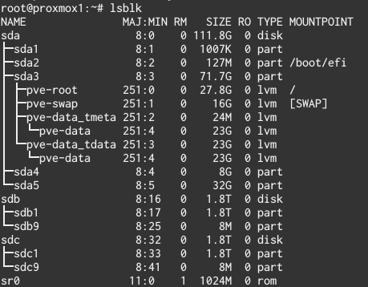
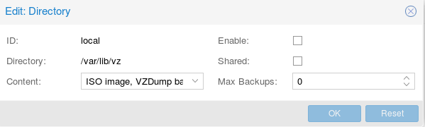

# Instalando proxmox 4.x

## Las características del servidor son:

Dell PowerEdge T605 Server
* 2x AMD Quad Core Opteron 2376 (2,3GHz, 6MB, 75W ACP)
* 32 GB RAM ECC REGISTERED
* 2x 2TB Western Digital RED SATA
* 1x 120GB SSD SATA Kingston 111 GB
* 1x SAS 6i/R controlador interno RAID PCI-E
* 4x NIC Gigabit Ethernet

## Instalación de Proxmox
Nota: Al instalar Proxmox, no se puede dejar la cantidad de espacio libre que queramos. Consecuentemente, en esta guía instalaremos el sistema base con unos LVM más pequeños de los necesarios y a continuación usaremos un LiveCD para encoger el tamaño de la partición del grupo de LVM

111GB Kingston SATA SSD - Sistema Base instalado en un partición ext4 + 8GB partición de log ZFS (ZIL) + 32GB partición caché ZFS (L2ARC)

        8GB  partición de Log.
        32GB partición caché ZFS.
        32GB / partición root
        16GB Partición Linux swap (ver nota debajo)
        32GB partición pve-data 

Este enfoque parece funcionar bastante bien, ¡pero asegurate de inicializar el valor de *vm.swappiness* a un valor bajo si tienes la partición de swap en un SSD! Incrementará el uso de la RAM un poco, pero es más facil tenerlo en el SSD y hace que la máquina vaya un poco más rápida. Normalmente el valor es 60, lo cual indica que cuando la RAM se llena al 60%, se empieza a paginar con el SSD. Podemos averiguar el valor actual con la orden:

```bash
    cat /proc/sys/vm/swappiness
```

Para cambiar el valor, debemos editar el fichero */etc/sysctl.conf* y añadir la línea:

```bash
    vm.swappiness = 10
```

Hay cinco opciones para inicializar el almacenamiento durante la instalación de Proxmox: 

    swapsize : tamaño de la swap de Linux.
    maxroot : Este es el tamaño de la partición / (root).
    minfree : Debería ser tu tamaño de log ZFS + cache ZFS. En mi disco SSD de 111GB, éste era 32+8=40.
    maxvz : Ésta es la partición pve-data al la que me refería arriba. 
    Filesystem : Déjalo en ext4 a menos que tengas una buena razón para no hacerlo.


Una vez hecho lo anterior, configura una contraseña y una zona horaria, y después configura la red. Debes asignar una IP fija que no debs cambiar por un largo periodo de tiempo, es bastante enredoso cambiar la IP. El FQDN no tiene que ser un nombre real (existente) en internet. Si no sabes cual poner, *servidor1.localdomain* será suficiente.


Una vez finalizada la instalación, ya podemos reiniciar, pero antes de esto, necesitamos encoger la partición de los LVM


## Reparando el particionamiento del SSD 

Usando un LiveCD, inicia gparted y cambia el tamaño de la partición del LVM

En las siguientes imágenes se muestra la secuencia de pasos:


(8GB Log ZFS + 32 GB Cache ZFS) = 40 * 1024 = 40960, por tanto encogeremos la partición 40960MB.


## Configura la nueva instalación de Proxmox

Ahora ya podemos iniciar normalmente proxmox.
Algo que hay que cambiar es añadir un parámetro al arranque de grub. Es el parámetro **rootdelay=10**. Para ello editaremos el archivo /etc/grub/default y añadiremos el parámetro al en la línea *GRUB_CMDLINE_LINUX_DEFAULT="rootdelay=10 quiet"* del fichero. Después habrá que ejecutar:
```bash
   sudo update-grub /dev/sda
```

Nota: Podemos realizar todo lo que viene a continuación desde una sesión SSH

## Cambiar los repositorios de Proxmox
Proxmox está destinado para su uso en entornos de producción con la compra de una suscripción de la compañía . Si hemos adquirido una suscripción , debemos introducir nuestra clave a través de la interfaz web y omitir este paso.

Abre el fichero /etc/apt/sources.list con tu editor de texto preferido y añade al final la línea *deb http://download.proxmox.com/debian jessie pve-no-subscription*.

También debes eliminar el repositorio para suscriptores de los orígenes de APT. Es un fichero que puedes borrar con la orden : *rm /etc/apt/sources.list.d/pve-enterprise.list*

Una vez realizados los cambios, ejecuta las siguientes órdenes (una detrás de otra):

```bash
   apt-get update
   apt-get upgrade -y
   update-grub
```

Esto descargará todas las actualizaciones que necesita , lo que puede tardar un tiempo dependiendo de la conexión aInternet.

## Realizar las particiones ZFS en el disco SSD

Vamos a utilizar la utilidad *cfdisk* de línea de comandos para dividir el espacio libre que hicimos en las particiones ZFS  de log y de cache. En nuestro caso estoy optando por una partición de Log de 8 GB y una partición de caché ZFS de 32 GB.

Ejecuta *cfdisk /dev/sda*. 

Se puede ver el espacio libre que hicimos antes resaltado en color morado . La interfaz de usuario basada en texto es bastante explicativa por sí misma , así que adelante y hacer las particiones que necesitamos. Se puede ver a continuación cómo lo hice mío de principio a fin.


Vamos a crear un RAID1 (mirror) con los dos discos de 2TB.

## Iniciando el pool ZFS
Ejecutamos la orden *lsblk* para ver los discos que tenemos conectados.


### Creando un nuevo pool ZFS
Para este sistema , quiero un pool raid1  con una caché L2ARC y un Log ZIL .

Sabemos de arriba que las 2 unidades mecánicas son sdb y sdc. También sabemos que mi registro es sda4 , y mi memoria caché es sda5 . Al crear el pool ZFS , tenemos que añadir /dev/ al principio de cada nombre de dispositivo . En Linux , /dev es el directorio en representación de todos los dispositivos del sistema.

Para crear el pool , ejecutaremos este comando :
```bash
   zpool create -f -o ashift=12 rpool mirror /dev/sdb /dev/sdc cache /dev/sda5 log /dev/sda4
```


Una vez hecho esto , puede ejecutar *zpool list* para verificar que el pool se ha creado. Ten en cuenta que el tamaño que se muestra aquí es el tamaño real total de los discos, no el espacio real utilizable.
```bash
   zpool list
   NAME    SIZE  ALLOC   FREE  EXPANDSZ   FRAG    CAP  DEDUP  HEALTH  ALTROOT
   rpool  1.81T   492K  1.81T         -     0%     0%  1.00x  ONLINE  -

```
### Creando un  sub-pool para las imágenes RAW  de las VM
Para obtener un rendimiento óptimo completo de máquinas virtuales (KVM), tenemos que crear un sub-bloque especial . No hay ningún requisito de hardware adicional para esto. Basta con ejecutar :

```bash
   zfs create rpool/vm-disks
```

Puedes leer más sobre lo que es necesario en la wiki de Proxmox. [https://pve.proxmox.com/wiki/Storage:_ZFS#Adding_ZFS_root_file-system_as_storage_with_Plugin]

### Añadir ZFS al sistema de almacenamiento de Proxmox
Hemos creado un pool ZFS , y podemos guardar cosas en él , pero ahora tenemos que decir a la interfaz web Proxmox donde está. Abre https://IP_maquina:8006 en un navegador web, asegurándose de utilizar HTTPS .


Disposición del almacenamiento
    
Vamos a tener 4 volúmenes de almacenamiento en esta instalación de Proxmox, además del volumen local por defecto, que en este caso será en el SSD:

        contenedores-zfs : Almacena sistemas de ficheros LXC 
        vm-disks : Amacena imágenes de disco RAW de una forma más eficiente que cualquier otra. Leer más aquí [https://pve.proxmox.com/wiki/Storage:_ZFS#Adding_ZFS_root_file-system_as_storage_with_Plugin]
        zfs-backups : Almacena backups de las máquinas virtuales
        zfs-templates : Almacena ISOs y templates de contenedores. Esto es opcional y podría haberse dejado en local en el SSD, dado que las ISOs y las templates LXC no son datos irremplazables.

Once you've logged in, go to Datacenter > Storage, and click Add > ZFS (in the top left) as shown below.

It is very important to choose only "Containers" under "Content." The rest of your settings should look like this, and are pretty straightforward.


Add another ZFS volume, call it vm-disks, and only allow "Disk Images" under "Content" this time. Also be sure to check "Thin provision." Your settings should look like this.


Now we've got our container storage and VM storage. The Proxmox ZFS plugin will only allow storing disk images and containers, so we're going to add a normal directory for the backups and ISO storage volumes. We know the mount point of the ZFS array (/my-zfs-pool) so it's an easy workaround.

Click "Add" again, only this time choose "Directory" instead of "ZFS."

For zfs-templates , I recommend allowing both container templates and ISO images. This gives you a single, easy place to store the tools to create containers and KVM virtual machines. Make sure for the directory you use the correct mount point! It will be /whatever-your-pool-name-was-that-you-set-earlier.


You can do almost the same thing for zfs-backups, just name it something different and allow only VZDump backup files, like so:


Once you're done, you should have 5 storage volumes counting the built-in local, which is on the SSD. I chose to disable local so I don't accidentally put things there, and you can do that by selecting it in the list of storage volumes, clicking "Edit" and unchecking "Enable".


Now if you expand the node dropdown to the far left, you should see something like this.


If you see all the volumes you wanted, you've done it correctly. Good job! You can click on them to view disk usage info, set permissions, and view content if you'd like. You can also upload content, so if you have ISOs that's how you upload them.

Congratulations! Your Proxmox+ZFS machine is ready to go. With the storage configuration I outlined, there is only one possible storage volume for each possible content type, so there's no way to accidentally put something in the wrong spot. You can create containers and VMs as normal now, and follow the Proxmox docs for migrating your backed up VMs over. More to come on this tutorial!


