# Instalando proxmox 5.1

###  Las características del servidor son:

ALDA CECQ77F01071 (SE3)
* Placa base Fujitsu
* Intel I7-3370 @ 3400Hz
* 32 GB RAM DDR3 @ 1600MHz
* 2x 2TB Western Digital RED SATA
* 1x 128GB SSD PCIE Plextor PX-AG128M6e Black edition
* 4x NIC Gigabit Ethernet

## 1. Instalación de Proxmox
Nota: Al instalar Proxmox, no se puede dejar la cantidad de espacio libre que queramos. Consecuentemente, en esta guía instalaremos el sistema base con unos LVM más pequeños de los necesarios y a continuación usaremos un LiveCD para encoger el tamaño de la partición del grupo de LVM

111GB Kingston SATA SSD - Sistema Base instalado en un partición ext4 + 8GB partición de log ZFS (ZIL) + 32GB partición caché ZFS (L2ARC)

        8GB  partición de Log.
        32GB partición caché ZFS.
        32GB / partición root
        16GB Partición Linux swap (ver nota debajo)
        31GB partición pve-data 

Este enfoque parece funcionar bastante bien, ¡pero asegurate de inicializar el valor de *vm.swappiness* a un valor bajo si tienes la partición de swap en un SSD! Incrementará el uso de la RAM un poco, pero es más facil tenerlo en el SSD y hace que la máquina vaya un poco más rápida. Normalmente el valor es 60, lo cual indica que cuando la RAM se llena al 60%, se empieza a paginar con el SSD. Podemos averiguar el valor actual con la orden:

```bash
    cat /proc/sys/vm/swappiness
```

Para cambiar el valor, debemos editar el fichero */etc/sysctl.conf* y añadir la línea:

```bash
    vm.swappiness = 10
```

Hay cinco opciones para inicializar el almacenamiento durante la instalación de Proxmox: 

    swapsize : tamaño de la swap de Linux.
    maxroot : Este es el tamaño de la partición / (root).
    minfree : Debería ser tu tamaño de log ZFS + cache ZFS. En mi disco SSD de 111GB, éste era 32+8=40.
    maxvz : Ésta es la partición pve-data al la que me refería arriba. 
    Filesystem : Déjalo en ext4 a menos que tengas una buena razón para no hacerlo.

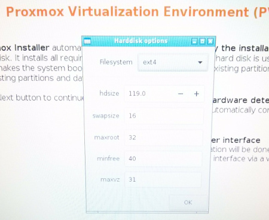


Una vez hecho lo anterior, configura una contraseña y una zona horaria, y después configura la red. Debes asignar una IP fija que no debs cambiar por un largo periodo de tiempo, es bastante enredoso cambiar la IP. El FQDN no tiene que ser un nombre real (existente) en internet. Si no sabes cual poner, *servidor1.localdomain* será suficiente.


Una vez finalizada la instalación, ya podemos reiniciar, pero antes de esto, necesitamos encoger la partición de los LVM


### 1.1. Reparando el particionamiento del SSD 

Usando un LiveCD, inicia gparted y cambia el tamaño de la partición del LVM

En las siguientes imágenes se muestra la secuencia de pasos:

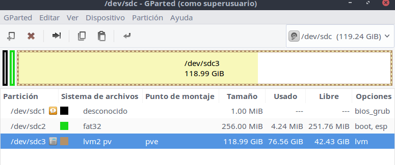

(8GB Log ZFS + 32 GB Cache ZFS) = 40 * 1024 = 40960, por tanto encogeremos la partición 40960MB.

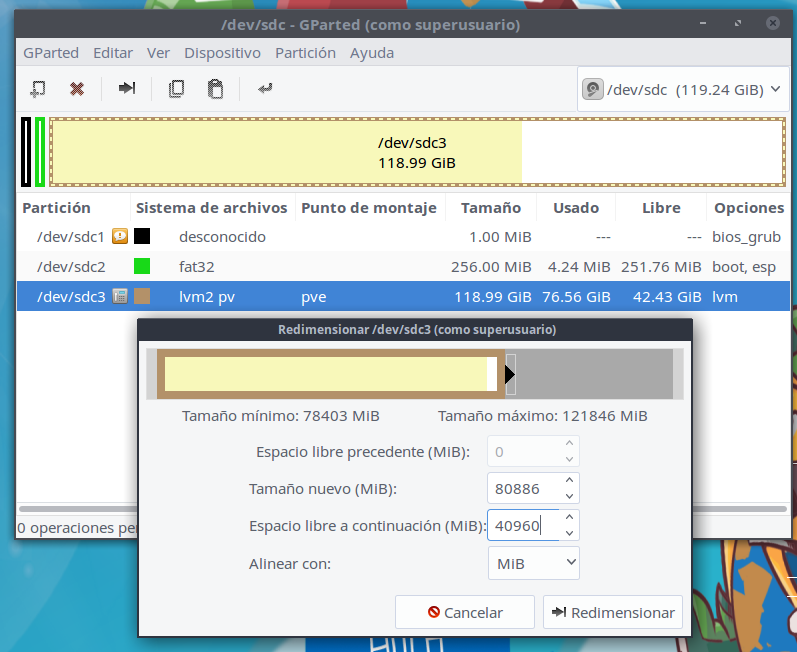

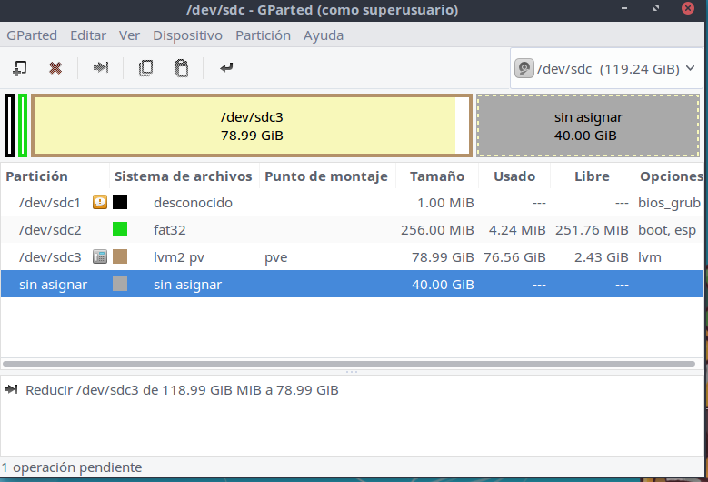

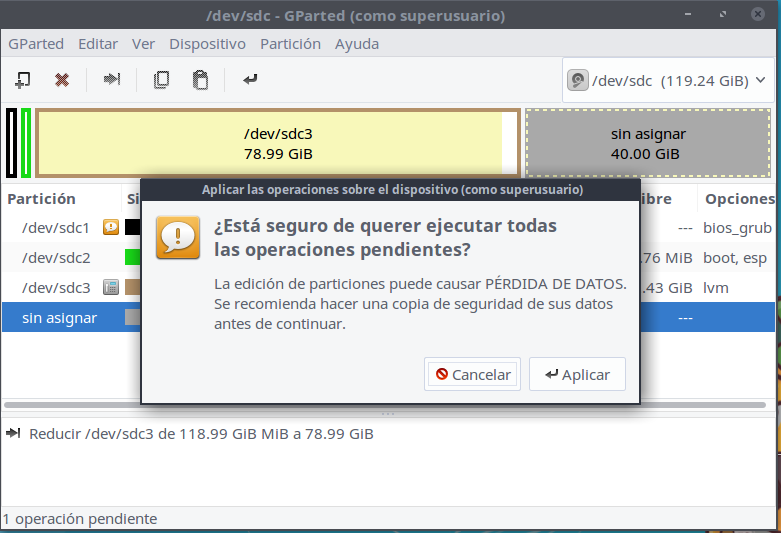

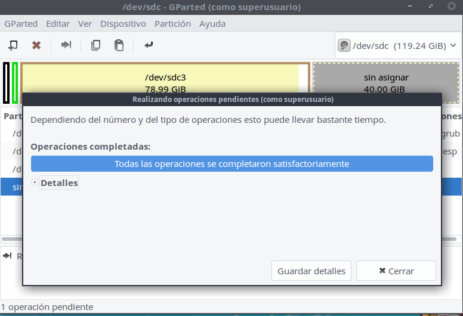

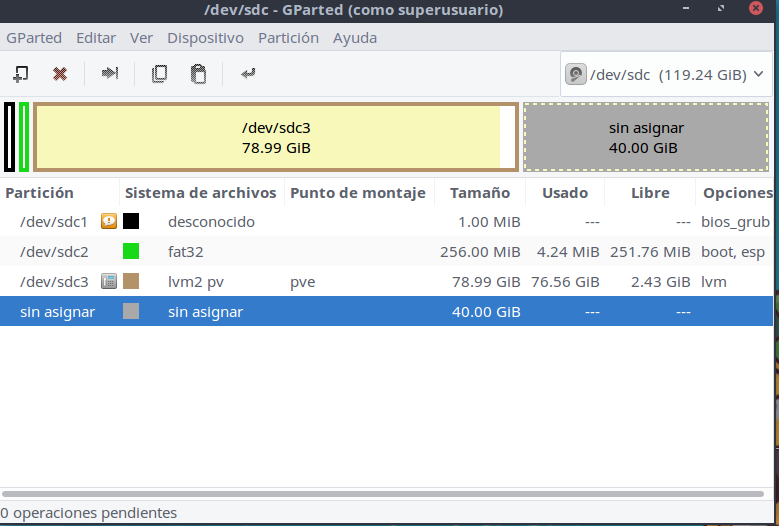

## 2. Configuramos la nueva instalación de Proxmox

Ahora ya podemos iniciar normalmente proxmox.
Algo que hay que cambiar es añadir un parámetro al arranque de grub. Es el parámetro **rootdelay=10**. Para ello editaremos el archivo /etc/default/grub y añadiremos el parámetro al en la línea *GRUB_CMDLINE_LINUX_DEFAULT="rootdelay=10 quiet"* del fichero. Después habrá que ejecutar:
```bash
   update-grub /dev/sda
```

Nota: Podemos realizar todo lo que viene a continuación desde una sesión SSH

### 2.1. Cambiar los repositorios de Proxmox
Proxmox está destinado para su uso en entornos de producción con la compra de una suscripción de la compañía . Si hemos adquirido una suscripción , debemos introducir nuestra clave a través de la interfaz web y omitir este paso.

Abre el fichero /etc/apt/sources.list con tu editor de texto preferido y añade al final la línea *deb http://download.proxmox.com/debian jessie pve-no-subscription*.

También debes eliminar el repositorio para suscriptores de los orígenes de APT. Es un fichero que puedes borrar con la orden : *rm /etc/apt/sources.list.d/pve-enterprise.list*

Una vez realizados los cambios, ejecuta las siguientes órdenes (una detrás de otra):

```bash
   apt-get update
   apt-get upgrade -y
   update-grub
```

Esto descargará todas las actualizaciones que necesita , lo que puede tardar un tiempo dependiendo de la conexión aInternet.

### 2.2. Realizar las particiones ZFS en el disco SSD

Vamos a utilizar la utilidad *cfdisk* de línea de comandos para dividir el espacio libre que hicimos en las particiones ZFS  de log y de cache. En nuestro caso estoy optando por una partición de Log de 8 GB y una partición de caché ZFS de 32 GB.

Ejecuta *cfdisk /dev/sda*. 

Se puede ver el espacio libre que hicimos antes resaltado en color morado . La interfaz de usuario basada en texto es bastante explicativa por sí misma , así que adelante y hacer las particiones que necesitamos. Se puede ver a continuación cómo lo hice mío de principio a fin.

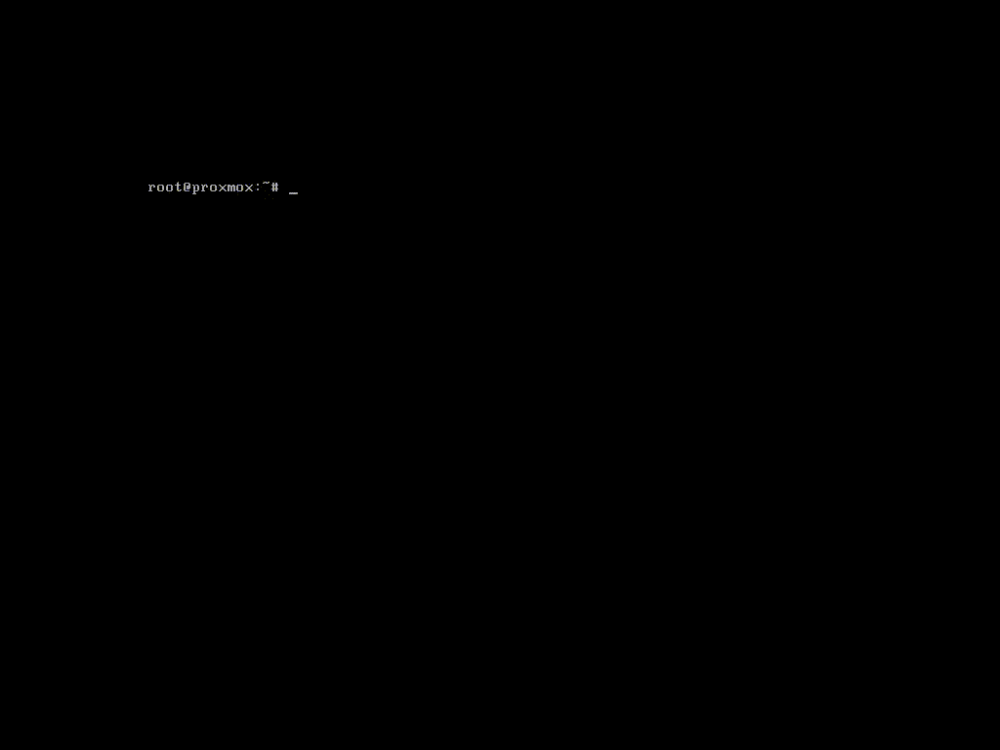

Vamos a crear un RAID1 (mirror) con los dos discos de 2TB.

### 2.3. Iniciando el pool ZFS
Ejecutamos la orden *lsblk* para ver los discos que tenemos conectados.
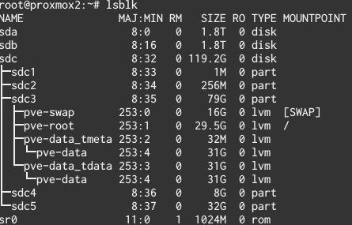

####  2.3.1. Creando un nuevo pool ZFS
Para este sistema , quiero un pool raid1  con una caché L2ARC y un Log ZIL.

Sabemos de arriba que las 2 unidades mecánicas son sda y sdb. También sabemos que mi registro es sdc4 , y mi memoria caché es sdc5 . Al crear el pool ZFS , tenemos que añadir /dev/ al principio de cada nombre de dispositivo. En Linux, /dev es el directorio en representación de todos los dispositivos del sistema.

Para crear el pool, ejecutaremos este comando :
```bash
   zpool create -f -o ashift=12 rpool mirror /dev/sda /dev/sdb cache /dev/sdc5 log /dev/sdc4
```
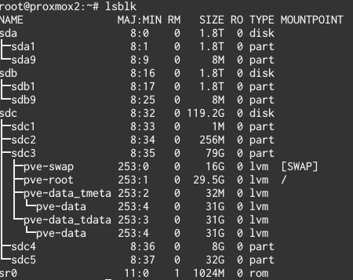
Mejor utilizar la opción by-id:
```
zpool create -f -o ashift=12 rpool mirror /dev/disk/by-id/ata-WDC_WD20EFRX-68EUZN0_WD-WCC4M7SY53N4 /dev/disk/by-id/ata-WDC_WD20EFRX-68EUZN0_WD-WCC4M0SY1FU5 cache /dev/disk/by-id/ata-PLEXTOR_PX-AG128M6e_P02539107818-part5 log /dev/disk/by-id/ata-PLEXTOR_PX-AG128M6e_P02539107818-part4
```
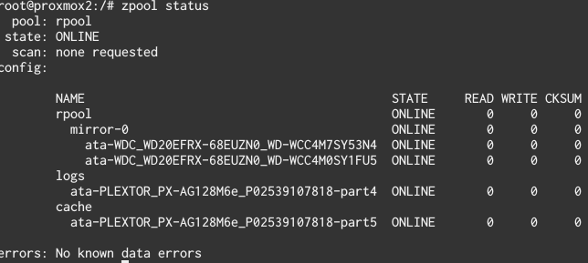

Una vez hecho esto , puede ejecutar *zpool list* para verificar que el pool se ha creado. Ten en cuenta que el tamaño que se muestra aquí es el tamaño real total de los discos, no el espacio real utilizable.
```bash
   zpool list
   NAME    SIZE  ALLOC   FREE  EXPANDSZ   FRAG    CAP  DEDUP  HEALTH  ALTROOT
   rpool  1.81T   492K  1.81T         -     0%     0%  1.00x  ONLINE  -

```
####  2.3.2. Creando un  sub-pool para las imágenes RAW  de las VM
Para obtener un rendimiento óptimo completo de máquinas virtuales (KVM), tenemos que crear un sub-bloque especial . No hay ningún requisito de hardware adicional para esto. Basta con ejecutar :

```bash
   zfs create rpool/vm-disks
   zfs create rpool/contenedores
   zfs create rpool/backups
   zfs create rpool/templates
```

Puedes leer más sobre lo que es necesario en la wiki de Proxmox. [https://pve.proxmox.com/wiki/Storage:_ZFS#Adding_ZFS_root_file-system_as_storage_with_Plugin]

### 2.4. Añadir ZFS al sistema de almacenamiento de Proxmox

Hemos creado un pool ZFS , y podemos guardar cosas en él , pero ahora tenemos que decir a la interfaz web Proxmox donde está. Abre *https://IP_maquina:8006* en un navegador web, asegurándote de utilizar HTTPS.


#### 2.4.1. Disposición del almacenamiento
    
Vamos a tener 4 volúmenes de almacenamiento en esta instalación de Proxmox, además del volumen local por defecto, que en este caso será en el SSD:

**contenedores-zfs:** Almacena sistemas de ficheros LXC.

**vm-disks:** Amacena imágenes de disco RAW de una forma más eficiente que cualquier otra. Leer más aquí [https://pve.proxmox.com/wiki/Storage:_ZFS#Adding_ZFS_root_file-system_as_storage_with_Plugin].

**zfs-backups:** Almacena backups de las máquinas virtuales.

**zfs-templates:** Almacena ISOs y templates de contenedores. Esto es opcional y podría haberse dejado en local en el SSD, dado que las ISOs y las templates LXC no son datos irremplazables.

Una vez hemos entrado en el interfaz web, vamos a Datacenter > Storage, hacemos click en Add > ZFS (arriba a la izquierda) tal como se muestra debajo.


Es muy importante elegir "Containers" dentro de "Content." El resto de la configuración deberían parecerse a esto, y son bastante claros.

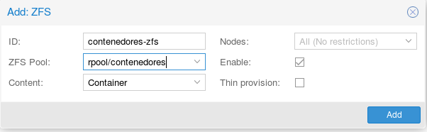

Añade otro volumen ZFS, llamalo *vm-disks*, y esta vez solo permite "Disk Images" dentro de  "Content". También asegurate de marcar la opción "Thin provision." Tu configuración debería parecerse a esta. 

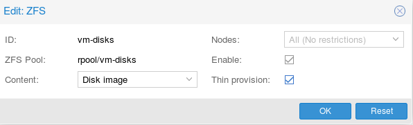

Ahora ya disponemos del almacenamiento de contenedores y de máquinas virtuales. El plugin ZFS de Proxmox solo permitirá almacenar imágenes y contenedores, por tanto vamos a añadir un directorio normal para los backups y los volúmenes de almacenamiento ISO. Sabemos que el punto de montaje del array ZFS (/rpool) por tanto es sencillo.  

Pulsa "Add" de nuevo, escoge "Directory" solo esta vez en lugar de "ZFS."

Para las *zfs-templates*, es recomendable permitir tanto templates de contenedores como imágenes ISO. Esto nos da un único sitio fácil para almacenar las herramientas para crear contenedores y máquinas virtuales KVM.
¡Asegurate de usar el correcto punto de montaje para el directorio! Será del tipo /nombre-del-pool-iniciado-antes. 


Puedes hacer casi lo mismo para zfs-backups, únicamente nombralo de forma diferente y permite solo ficheros del tipo VZDump backup, como se muestra en la imagen:

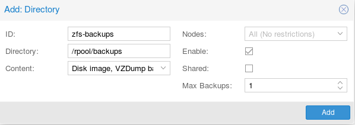

Una vez finalizado, deberían haber 5 volúmenes de almacenamiento contando el volúmen *local*, que está en el SSD.
Es una buena idea deshabilitarlo para no poner cosas accidentalmente ahí, para ello seleccionalo en la lista de volúmenes de almacenamiento, haz click en "Edit" y quita la marca de "Enable".


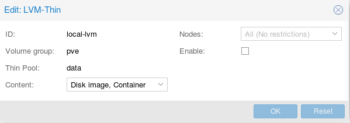

Ahora, si expandimos el nodo de la izquierda, debería aparecer algo como esto:

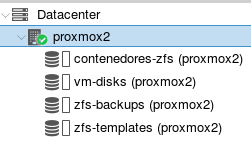

Si aparecen todos los volúmenes que querías, es que lo has realizado correctamente. ¡Buen trabajo! Puedes hacer click en ellos para ver la información del uso de disco, configurar permisos y ver el contenido. También puedes subir contenido.

¡Enhorabuena! Tu máquina con Proxmox+ZFS está preparada para funcionar. Con la configuración de almacenamiento mostrada en esta guía, hay un único volumen de almacenamiento para cada tipo de contenido, por tanto no hay forma de poner algo en el lugar incorrecto accidentalmente. 

¡Ahora puedes crear de forma normal contenedores y máquinas virtuales.!


Para evitar el mensaje de la suscripción en el interfaz web:

```bash
   cp /usr/share/pve-manager/js/pvemanagerlib.js /usr/share/pve-manager/js/pvemanagerlib.js_BKP
   vi /usr/share/pve-manager/js/pvemanagerlib.js 
   Sustituimos 
       if (data.status !== 'Active')
   por
      // if (data.status !== 'Active') {
         if (false){
```

Para poder añadir o sustituir discos al rpool:

Autoexpandir:
```
zpool set autoexpand=on rpool
```
Reemplazar discos:
```
zpool set autoreplace=on rpool
```
para que las snapshots aparezcan al hacer zfs list
```
zpool set listsnapshots=on rpool
```
Activate Email notification
to activate the daemon it is necessary to edit /etc/zfs/zed.d/zed.rc with your favored editor.

Important: the only settings what is required is ZED_EMAIL the other are optional.

After editing the zed.rc you have to restart the daemon.

service zed restart

Para limitar la memoria que usa ZFS:
Memoria para ZFS

/etc/modprobe.d/zfs.conf

# 16GB=17179869184, 8GB=8589934592, 4GB=4294967296, 2GB=2147483648, 1GB=1073741824, 500MB=536870912, 250MB=268435456
#1GB
options zfs zfs_arc_max=1073741824


PROXMOX RENDIMIENTO EN STORAGE TIPO ZFS
Usan un dev zvol RAW. Por defecto el tamaño de bloque es de 4KB. Aumentar a 32 mejora. Editar /etc/pve/storage.cfg

zfspool: rpool

        pool rpool

        blocksize 32k

        content images

        sparse


Configuraciones adicionales:

Tarjetas de red:


Acceso SSH mediante clave pública:
En la máquina cliente generamos el par de claves pública/privada:
ssh-keygen -b 4096

ssh-keygen generará dos archivos:

id_rsa es la clave privada, la que permanecerá en la máquina local.
id_rsa.pub es la clave pública, la que se tiene que copiar al servidor remoto al que se quiere acceder.
COPIAR LA CLAVE PÚBLICA AL SERVIDOR

Una vez generado el par de claves en la máquina local hay que copiar la clave pública al servidor remoto:
user@localmachine$ scp ~/.ssh/id_rsa.pub user@remotemachine:/home/user/uploaded_key.pub

La clave pública hay que incluirla en el archivo /home/user/.ssh/authorized_keys. Si la carpeta .ssh no existe, la creamos antes de copiar, así como el archivo authorized_keys:
user@remotemachine$ echo `cat ~/uploaded_key.pub` >> ~/.ssh/authorized_keys
user@remotemachine$ rm /home/user/uploaded_key.pub


